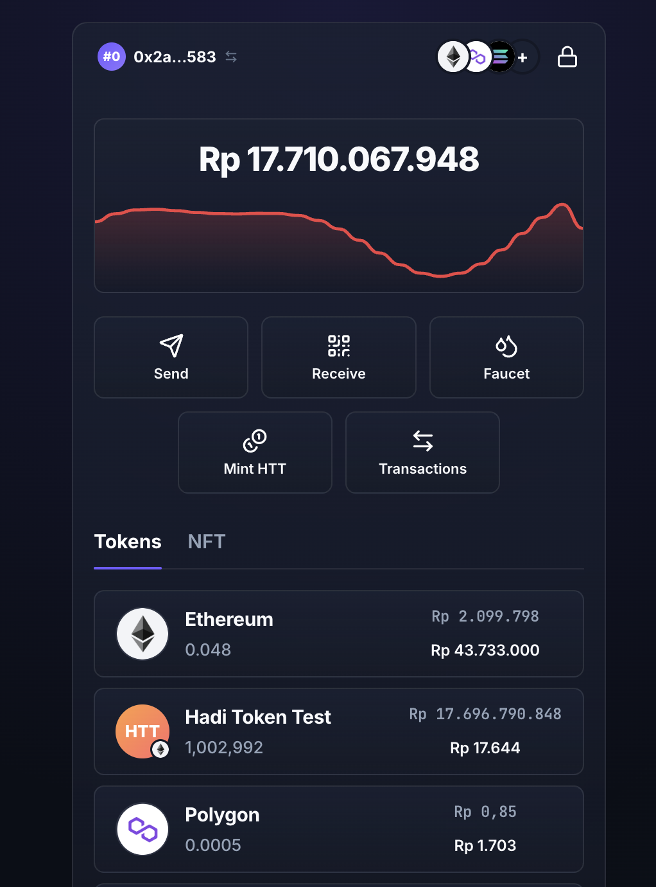

# Token Testing & Faucet Playground 🚀

Aplikasi multi-chain khusus lingkungan **testnet** untuk pengujian lifecycle token, klaim faucet, pembuatan token uji (ERC-20, SPL Token, XRPL IOU), pelacakan portofolio real-time, dan simulasi transfer aset aman antar-akun.

<p align="center">
  
</p>

* **Antarmuka Utama:** **Web Application & Browser Extension (Vite + React + TypeScript)** dengan estetika premium **Rabby Wallet** (Dark Slate `#0C0D14`, Rabby Purple `#705BFF`, efek Glassmorphism 3-tier, 24h interactive sparkline chart, kartu portfolio terpadu dalam Rupiah (IDR), dan pre-execution safety simulation).
* **Keamanan Berlapis (Encrypted Vault):** Mnemonic dienkripsi dengan standar industri **AES-256-GCM** + **PBKDF2** (100.000 iterasi SHA-256) menggunakan WebCrypto API bawaan browser, disimpan secara aman di browser storage (`localStorage` & `chrome.storage.local`), dan hanya di-dekripsi ke RAM saat sesi dibuka dengan password Anda.
* **Opsi QR Code & In-Memory:** Mendukung pemulihan cepat via Scan QR (kamera webcam / upload file foto) atau frasa 12/24 kata tanpa menyimpan plaintext di disk.
* **Antarmuka Kedua:** **CLI (`pg`)** untuk scripting dan pengujian langsung lewat terminal.

> [!WARNING]
> **TESTNET ONLY — NOL NILAI NYATA**
> Playground ini dilindungi secara ketat oleh fungsi `assertTestnet()` yang memblokir transaksi ke Mainnet Chain ID. **Dilarang keras** menggunakan frasa mnemonic atau kunci privat dari dompet utama/produksi Anda!

---

## Fitur Utama

- 💎 **Rabby-Inspired Glassmorphism UI**: Antarmuka modern dengan gradien halus, efek blur dinamis (`backdrop-filter`), squircles, dan micro-interactions yang responsif.
- 🔐 **Penyimpanan Aman (Encrypted Vault)**: Proteksi password dengan derivasi kunci PBKDF2 (100k rounds) & enkripsi AES-256-GCM. Kunci wallet kapan saja dan buka kembali dengan satu input password.
- 📈 **Portfolio Hero & 24h Area Sparkline**: Total saldo multi-chain dikonversi otomatis ke estimasi Rupiah (IDR) lengkap dengan grafik sparkline 24 jam interaktif.
- 🌐 **Multi-Chain Testnets**: Dukungan penuh untuk Ethereum Sepolia, Polygon Amoy, Solana Devnet, XRPL Testnet, dan Bitcoin Signet.
- 🔀 **Filter Jaringan & Account Switcher**: Stacked chain logos interaktif untuk filter aset per jaringan, serta account switcher instan (Index 0 Utama & Index 1 Penerima).
- 🚰 **Integrated Faucet**: Klaim testnet coin dalam 1-klik (Solana Devnet SOL, XRPL Testnet XRP) serta tautan cepat ke faucet resmi EVM & Bitcoin.
- 🪙 **Mint & Deploy Token Uji**: Cetak token uji seperti HTT (Hadi Token Test) atau deploy kontrak ERC-20, SPL Token, dan XRPL Trustline/IOU langsung dari antarmuka.
- 🛡️ **Pre-Execution Simulation**: Simulasi transfer dengan Green Shield guard, pengecekan delta saldo pengirim & penerima, estimasi gas fee, dan peringatan ATA rent / reserve.
- 🧩 **Dual Target (Web & Chrome Extension)**: Dapat dijalankan sebagai aplikasi web tab penuh maupun ekstensi browser Chrome/Brave Manifest V3.

---

## Daftar Ledger yang Didukung

| Ledger | Jaringan Testnet | Chain ID / Net ID | Derivation Path | Format Alamat | Status |
|---|---|---|---|---|---|
| **Ethereum** | Sepolia | `11155111` | `m/44'/60'/0'/0/{i}` | EIP-55 Checksum (`0x…`) | **Aktif** |
| **Polygon** | Amoy | `80002` | `m/44'/60'/0'/0/{i}` | EIP-55 Checksum (`0x…`) | **Aktif** |
| **Solana** | Devnet | `solana-devnet` | `m/44'/501'/{i}'/0'` | Base58 (SLIP-0010 All-Hardened) | **Aktif** |
| **XRPL (Ripple)** | Testnet | `xrpl-testnet` | `m/44'/144'/0'/0/{i}` | Classic Address (`r…`) | **Aktif** |
| **Bitcoin** | Signet | `btc-signet` | `m/84'/1'/0'/0/{i}` | Bech32 Native SegWit (`tb1q…`) | **Aktif (Saldo)** |
| **Kaia** | Kairos | `1001` | *60 vs 8217* | EIP-55 Checksum (`0x…`) | **Ditunda (Backlog)** |

---

## Memulai Aplikasi Web (Primary)

```bash
# 1. Instal dependensi
npm install

# 2. Jalankan Dev Server Web UI
npm run dev
```

Buka browser di `http://localhost:3000`.

### Alur Penggunaan Web UI

1. **Setup & Buka Wallet:**
   - **Pertama Kali:** Generate seed phrase baru atau import via scan QR/input frasa. Buat password enkripsi minimal 6 karakter untuk mengamankan vault lokal.
   - **Pengguna Terdaftar:** Cukup masukkan password untuk membuka dompet secara instan.
   - **Kunci Sesi:** Klik ikon gembok di header kanan atas kapan saja untuk mengunci kembali wallet.
2. **Dashboard & Portfolio Hero:**
   - Pantau total kekayaan gabungan multi-chain dalam estimasi Rupiah (IDR).
   - Gunakan pemilih jaringan (ikon logo Ethereum, Polygon, Solana, atau All Chains) untuk memfilter aset.
   - Beralih antar Akun #0 (Utama) dan Akun #1 (Penerima) melalui account pill di header kiri.
3. **Klaim Faucet:**
   - Klik tombol **Faucet**:
     - Solana Devnet: 1-klik `Airdrop 1 SOL`.
     - XRPL Testnet: 1-klik `Fund XRP`.
     - Sepolia / Amoy / Signet: Akses faucet resmi testnet dengan alamat yang siap di-copy.
4. **Deploy & Mint Token Uji:**
   - Klik tombol **Mint HTT / TST** untuk mencetak token uji instan di jaringan yang didukung.
5. **Kirim Aset (Send Asset) dengan Simulasi Keamanan:**
   - Klik tombol **Send**.
   - Pilih aset (Native Coin atau Test Token).
   - Gunakan tombol shortcut **"+ Akun #1 (Milik Sendiri)"** untuk transfer antar akun derivasi Anda.
   - Periksa simulasi pre-flight (*Green Shield*, estimasi gas fee, dan simulasi perubahan saldo).
   - Tanda tangani transaksi dan periksa status langsung di Block Explorer.

---

## Menjalankan sebagai Web Extension (Chrome / Brave Manifest V3) 🧩

Aplikasi ini dapat langsung dipasang sebagai **ekstensi browser** (popup toolbar atau side panel):

```bash
# 1. Build bundle ekstensi (output ke dist/ext)
npm run build:ext
```

### Cara Memasang di Chrome / Brave:
1. Buka `chrome://extensions/` (atau `brave://extensions/`) di browser Anda.
2. Aktifkan sakelar **"Developer mode"** di pojok kanan atas.
3. Klik tombol **"Load unpacked"** di pojok kiri atas.
4. Pilih folder **`dist/ext`** dari repository ini.
5. Selesai! Pin ikon **Token Testnet Playground** ke toolbar browser Anda.

### Fitur di Lingkungan Ekstensi:
* **Popup Viewport yang Pas**: Desain responsif otomatis menyesuaikan dimensi popup wallet (~400px x 600px).
* **Storage Vault Sinkron (`chrome.storage.local`)**: Vault terenkripsi disimpan dengan aman pada storage ekstensi browser.
* **Side Panel Ready**: Mendukung Chrome Side Panel API (`chrome.sidePanel`) untuk pengujian dApp berdampingan.

---

## Menggunakan CLI (`pg`) (Secondary)

CLI dapat digunakan jika Anda lebih menyukai antarmuka terminal:

```bash
# 1. Konfigurasi .env (opsional untuk CLI)
cp .env.example .env
# Isi MNEMONIC="..." di .env

# 2. Perintah CLI
npm run pg -- seed new                     # Buat mnemonic baru
npm run pg -- seed info                    # Cek fingerprint mnemonic
npm run pg -- address                      # Tampilkan address Index 0 untuk semua ledger
npm run pg -- address -i 1                 # Tampilkan address Index 1
npm run pg -- balance                      # Cek saldo native semua ledger
npm run pg -- faucet -l solana             # Airdrop 1 SOL
npm run pg -- send -l ethereum --to 1 -a 0.001 --dry-run  # Simulasi kirim tanpa broadcast
```

---

## Pengujian & Verifikasi Kualitas

```bash
# Menjalankan 45 unit tests Vitest (Derivasi, bigint arithmetic, guards, chart SVG, exchange rates, encrypted vault)
npm test

# Menjalankan oxlint (linter performa tinggi)
npm run lint

# Kompilasi TypeScript, Web bundle, dan Chrome Extension bundle
npm run build && npm run build:web && npm run build:ext
```

---

## Struktur Direktori Proyek

```
test-playground/
├── src/
│   ├── web/                       # Web Application (Rabby Wallet Style)
│   │   ├── components/            # Modals (PasswordUnlock, SetPassword, Send, Faucet, Receive, Mint, QR)
│   │   ├── context/               # SessionContext (Encrypted vault + in-memory runtime session)
│   │   ├── styles/                # rabby.css (Glassmorphism tokens, dark palette, layout)
│   │   ├── App.tsx                # Dashboard & Screen router utama
│   │   └── main.tsx               # React root entry
│   ├── cli/                       # CLI commands (pg seed, address, balance, faucet, send)
│   ├── contracts/                 # TestToken.sol & TestTokenArtifact.ts
│   ├── adapters/                  # Multi-chain adapters (EVM, Solana, XRPL, Bitcoin)
│   ├── core/                      # vault.ts (AES-GCM/PBKDF2), amount.ts, derive.ts, mnemonic.ts, registry.ts, types.ts
│   └── config/                    # networks.ts, tokens.ts
├── test/                          # Unit tests (vault, amount, chart, history, rates, vectors)
├── public/
│   └── preview.png                # Tangkapan layar antarmuka aplikasi
├── index.html                     # Web entry HTML
├── vite.config.ts                 # Vite bundler & browser crypto polyfills
├── tsconfig.json                  # Strict TypeScript configuration
├── PLAN.md                        # Master architectural specification
├── TODO.md                        # Task checklist & execution gates
└── ledger.md                      # Supported ledgers & status matrix
```
